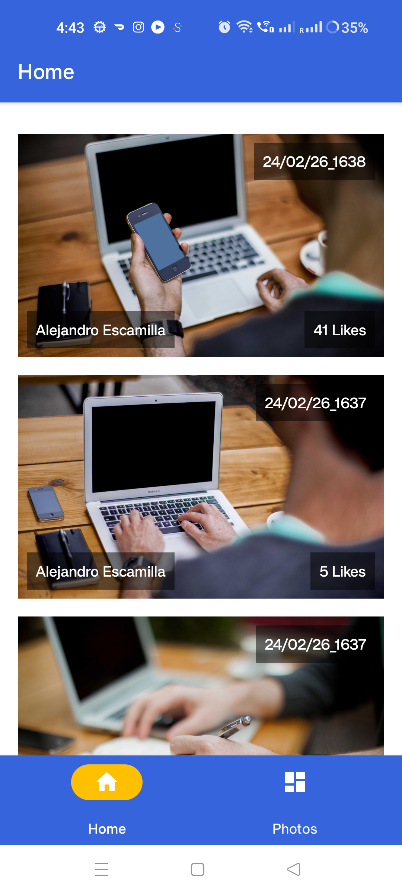
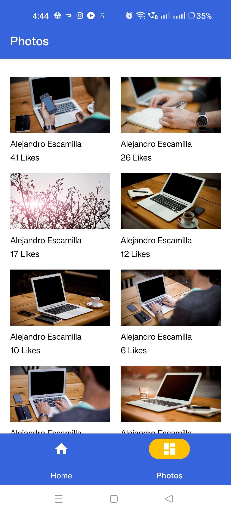
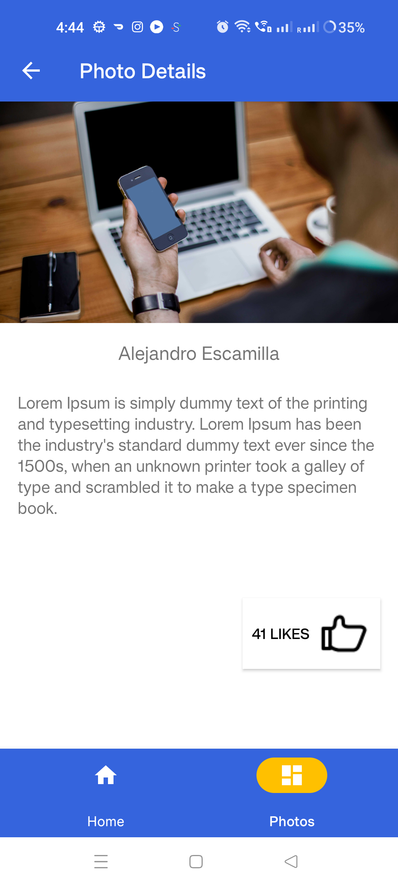

# Demo Android Application - Kotlin MVVM Photo App

Welcome to the Demo Android Application built with **Kotlin** and following the **MVVM** architecture! This app utilizes the **https://picsum.photos/ API** to fetch photos list

## Features:

1. **List of photos as Gridview:**
   - Users can see the photos as grid.

2. **Most recent viewed photos:**
   - The application stores the like count and last viewed information in database to show at Home page

3. **Offline support:**
   - Application caches the data to the local database and user can view the cached data offline.

## Technology Stack:

- **Kotlin:** The modern and expressive programming language for Android development.
  
- **MVVM Architecture:** A design pattern that separates the app into three main components (Model, View, ViewModel), promoting clean and maintainable code.

- **https://picsum.photos/ API:** Seamless integration with the API for real-time and up-to-date data.

- **Other libraries used:** Coroutines, Room, Dependency Injection (Hilt), View Binding, JUnit, Retrofit

## Screenshots:

  
  
  

## Recording:

